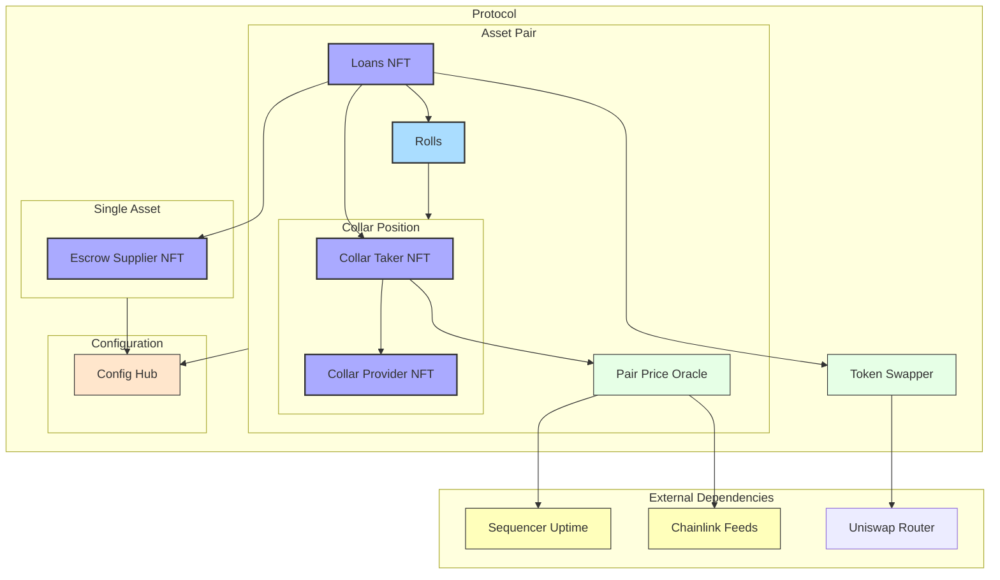
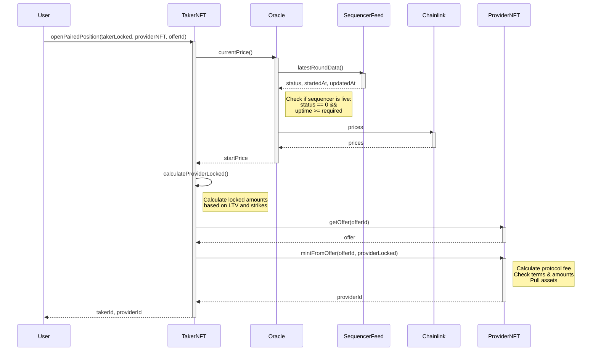
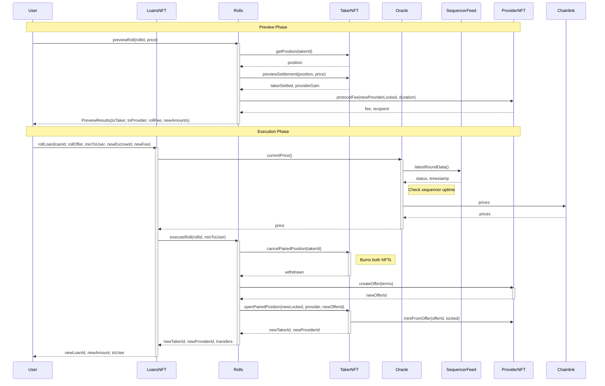
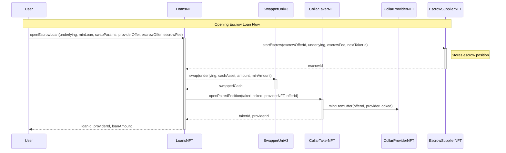
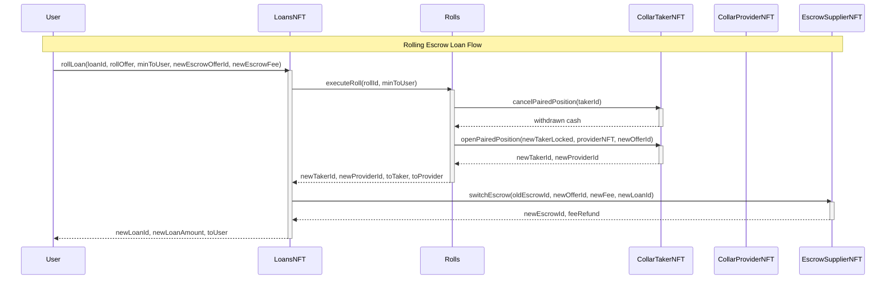

# Some Diagrams

## ⚠️ The map is NOT the territory

These *may* be useful for high level overview or easier introduction to the codebase. However, such diagrams are always incomplete and inaccurate. 

### High level architecture

> Checked and tweaked manually

### Example Call Flows

> All the below were not validated to be accurate, but seemed to be potentially useful as intro aids

#### `CollarTakerNFT.openPairedPosition`

#### `Rolls.executeRoll`

#### `LoansNFT.openEscrowLoan`

#### `LoansNFT.rollLoan` (escrow based loan)

